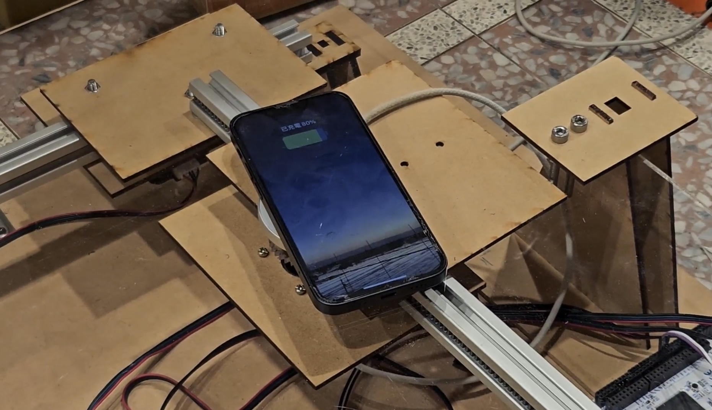

# 2024 MakeNTU Project

## What is MakeNTU

MakeNTU is a hackathon held by NTUEE. The contest lasts for 24 hours, and the attending teams are supposed to build a product featuring both hardware and software implementation. 50-ish teams joined the competition this year.

# Project Description: Automatic Tracking and Charging Desktop

We create an automatic tracking and charging desktop. 

STM32 U575ZI development board is used as the main control board, connected to a HC05 Bluetooth module and NEMA17 stepper motors to control the position of the wireless charger. A camera was used to monitor the desk, and a computer would then process the collected camera footage using YOLO v8 model to locate the phone. The location information was then transmitted to the STM32 development board via Bluetooth, which drove the motors to move the wireless charger under the desk to achieve active tracking and charging functionality.

The whole idea comes from this [video](https://www.youtube.com/watch?v=JrasYJDyg4Q)

To see how it work please watch the [video](https://drive.google.com/file/d/1D8ejN8aws75AzB3uTx0aBy2nEfk7af9W/view?usp=sharing) 
Our presentation slides [link](https://docs.google.com/presentation/d/15X92Lmv90sgRnkveBSQfuRx1iELKd2kf/edit?usp=sharing&ouid=102782269072995870803&rtpof=true&sd=true)

## Project Overview

- Hardware Implementation
- Software Implementation
- Others

### Hardware Implementation

The physical architecture is built using AutoCAD and manufactured by laser cut.

### Software Implementation
We use YOLO v8 provided by ultralytics to detect the cellphone on the desktop and get the position of the cellphone. Since the camera resolution is quite bad. We use hundreds of photos take by the camera and label the photos by Roboflow to fine tune the YOLO model.

### Others

Image Calibration:
Images are often subject to [perspective distortion](https://en.wikipedia.org/wiki/Perspective_distortion). This can trigger a serious problem when one needs to use an unprocessed image to find the exact position of an item. Therefore, in this project, we use several [linear equations and the corner positions](https://jason-chen-1992.weebly.com/home/-perspective-distortion-correction) to make corrections and hence cope with this issue.
